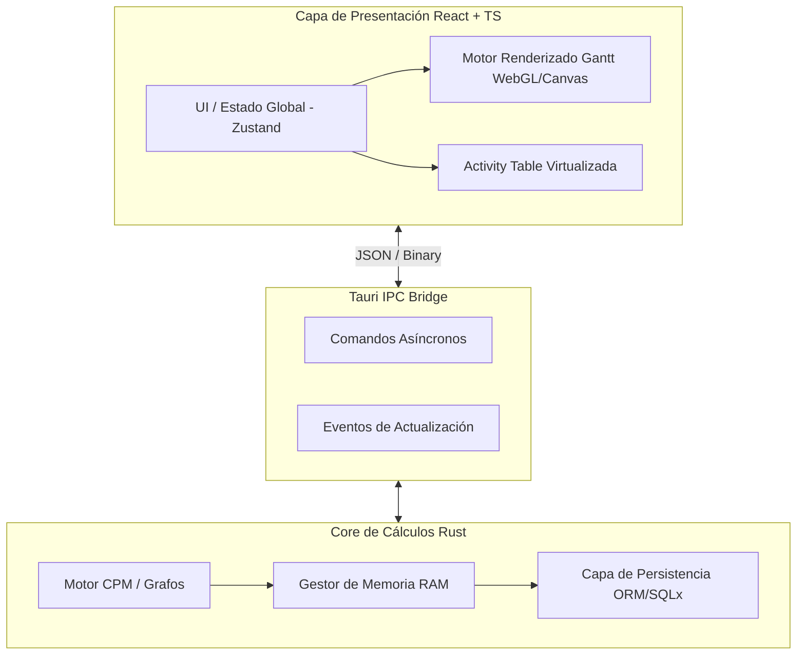
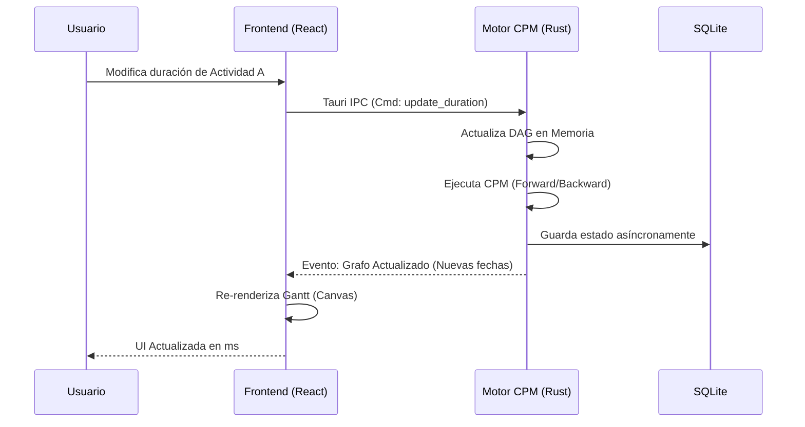

% Roadmap: Clon Moderno de Primavera P6
% Arquitecto de Software
% 2026

-> # Visión General del Proyecto <-

Desarrollo de un sistema Enterprise Project Portfolio Management (EPPM) de ultra-alto rendimiento. 
Diseñado para superar las limitaciones de software legacy (como Primavera P6) mediante arquitecturas modernas.

**Tecnologías Principales:**
*   **Motor/Core:** Rust (Rendimiento, gestión de memoria, concurrencia sin data races).
*   **Frontend:** React + TypeScript + WebGL/Canvas (Gantt).
*   **Contenedor:** Tauri (Aplicación de escritorio ligera y rápida).
*   **Base de Datos:** SQLite (Local) / PostgreSQL (Cloud/Server).

---

-> # Arquitectura del Sistema <-

El sistema utiliza Tauri como puente de comunicación eficiente entre una interfaz web altamente interactiva y un motor de cálculos pesados escrito en Rust.

---

-> # Roadmap de Desarrollo: Fase 1 - Fundamentos <-

**Objetivo:** Establecer la estructura de datos y el motor básico de cálculos.

1.  **Modelado de Datos (Rust Structs):**
    *   Definición de `Project`, `WBS` (Work Breakdown Structure).
    *   Definición de `Activity` (ID, Duración, Calendario asignado).
    *   Definición de `Relationship` (FS, SS, FF, SF, Lags).

2.  **Motor CPM Básico (Critical Path Method):**
    *   Construcción del Grafo Dirigido Acíclico (DAG).
    *   Implementación de detección de bucles (Cycle Detection).
    *   *Forward Pass:* Cálculo de Early Start (ES) y Early Finish (EF).
    *   *Backward Pass:* Cálculo de Late Start (LS) y Late Finish (LF).
    *   Cálculo de Holguras: Total Float (TF) y Free Float (FF).

---

-> # Roadmap de Desarrollo: Fase 2 - Interfaz Principal <-

**Objetivo:** Crear la experiencia visual sin cálculos pesados.

1.  **Estructura Base (React/Tauri):**
    *   Configuración inicial de Tauri + React + Vite.
    *   Implementación de diseño modo oscuro/claro (CSS Variables / Tailwind).

2.  **Activity Table Virtualizada:**
    *   Implementación de una tabla capaz de cargar 100,000 registros.
    *   Jerarquía WBS plegable (Expand/Collapse) sin recargar DOM.
    *   Conexión IPC para pedir "chunks" de datos al motor Rust.

3.  **Diagrama de Gantt Básico:**
    *   Configuración del Canvas/WebGL.
    *   Dibujo de barras según fechas ES/EF.
    *   Sincronización de scroll vertical entre Activity Table y Gantt.

---

-> # Roadmap de Desarrollo: Fase 3 - Funcionalidad Avanzada <-

**Objetivo:** Alcanzar paridad con características core de P6.

1.  **Gestión de Calendarios:**
    *   Horarios laborales, excepciones, festivos.
    *   Cálculo de duraciones basadas en horas netas laborables.

2.  **Asignación de Recursos y Costos:**
    *   Diccionario de Recursos (Labor, Non-Labor, Material).
    *   Curvas de distribución de recursos (Linear, Bell, etc.).
    *   Cálculo de costos acumulados y Earned Value (EVM).

3.  **Nivelación de Recursos (Resource Leveling):**
    *   Algoritmos heurísticos en Rust para desplazar actividades basadas en prioridad y float cuando hay sobreasignación de recursos.

---

-> # Roadmap de Desarrollo: Fase 4 - Enterprise & Mejoras <-

**Objetivo:** Diferenciarse como la herramienta más moderna del mercado.

1.  **Líneas Base Múltiples (Baselines):**
    *   Guardar instantáneas rápidas del proyecto en SQLite.
    *   Comparación visual en el Gantt (barras superpuestas).

2.  **Deshacer/Rehacer Ilimitado (Time-Travel):**
    *   Implementar arquitectura Event Sourcing en Rust para registrar cada mutación del DAG.

3.  **Colaboración Multi-usuario (Versión Cloud):**
    *   Migrar backend a servidor central.
    *   Sincronización de cambios por WebSockets (CRDTs o Operational Transformation).

---

-> # Posibles Mejoras (Innovación vs P6) <-

*   **IA Predictiva Integrada:** Modelo local que analice históricas duraciones y avise cuando el usuario estime una tarea por debajo de la media estadística.
*   **Importación Rápida:** Lector de archivos `.XER` nativo en Rust, capaz de importar proyectos masivos en una fracción de segundo frente a los minutos que tarda P6.
*   **Filtros Globales a 60fps:** Motor de búsqueda de memoria en Rust capaz de filtrar cientos de miles de actividades instantáneamente mientras se teclea en el frontend.
*   **Soporte Multiplataforma Nativo:** Gracias a Tauri, exportable fácilmente a Windows, macOS y Linux sin reescribir código.
